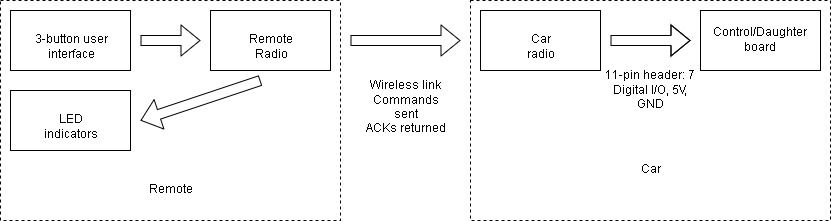
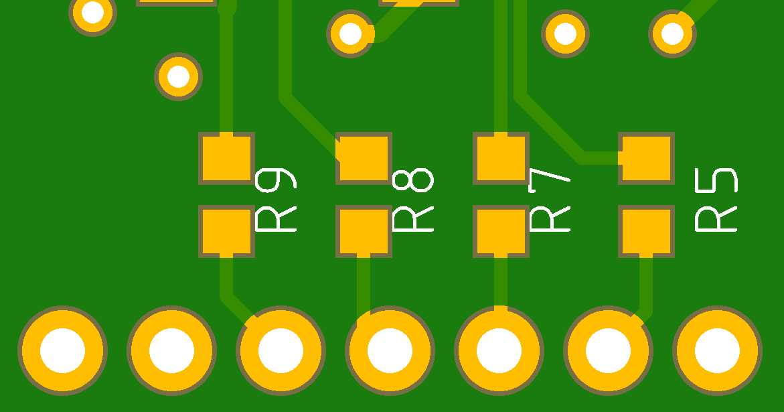
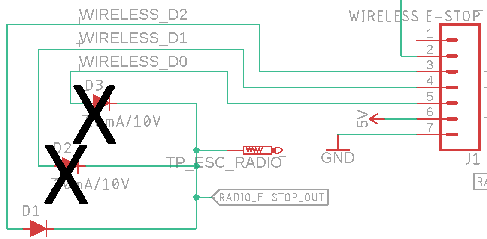
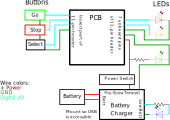

# Requirements
 * Must have 'deadman' logic to stop car if signal is lost
 * Must have >400' range (for EVGP)
 * Must interface with Sedanii's current 7 pin header
 * Must be able to handle reconnecting
 * Must have a simple control box (in addition to any other controls)
 * Must have >7-hour battery life with replaceable battery
 * Must have indicator LEDs on remote to show state
 
# Information flow block diagram

# Receiver
Every loop, we check for a new radio message. If there is one, check if it is a valid GO or STOP message. If yes, set flag to start or stop car. If no valid messages received for a certain length of time, automatically stop car.

## Firmware
See code comments - will be more up-to-date.
 
### Sedanii's E-stop state machine
1. GO
    1. Transitions to STOP upon receiving stop signal.
    2. Transitions to DISCONNECTED if no signals for >0.5 sec
2. STOP
    1. Transitions to GO upon receiving go signal
    2. Transitions to DISCONNECTED if no signals for >0.5 sec
3. DISCONNECTED
    1. Transitions to STOP upon receiving stop signal.
    2. Transitions to GO upon receiving go signal.

### EVGP's E-stop state machine
1. GO
2. Drive Disabled
3. Drive + Steering Disabled (or Disconnected)
4. Power Off Car

## Hardware
Connect the PCB to the control board by the 7 unboxed pins of the 11 pin header. Solder 0 ohm resistors for R2-R5 on the back of the board:

Make sure to remove diodes 2 and 3 from the control board. Otherwise, **the e-stop will enable the car when it is just indicating the auxiliary switch is on.**

### LEDs
 * The Green LED is for the 5V line.
 * The Red LED is for the 3.3V line.
 * The Yellow LED is MCU-controlled (probably to indicate connection status).
 * There is NO LED on the board to indicate if the car is enabled or disabled - the control board has its own enable/disable light.

# Transmitter
Every TRANSMIT_PERIOD ms, send out a message. If no ACK received, retry several times before failing to send the message.

## Hardware

### Remote wiring diagram

### LEDs
 * Green is power
 * Red indicates if the car is enabled
 * Yellow indicates if the last message was successfully transmitted. Slightly different than if the remote has lost connection.
 * Blue is low battery.

### Buttons
Connect all the buttons but the Power switch to the PCB via the 4 boxed pins of the 11-pin header.
 * Power switch 
 * Green GO button to enable car
 * Red STOP button to e-stop car
 * Signal switch (ex. to signal the car to record bag files).
 
## Firmware
See code comments - will be more up-to-date.

# Major hardware parts
 * Sparkfun radio RFM69HCW (915 MHz version): radio chips
 * ATMEGA MCU (3.3 V version): Microcontroller
 * USB battery charger to charge battery and supply 5V to the board: www.adafruit.com/product/1944
 * 2000mAh Li-ion battery: www.adafruit.com/product/2011
 * Buttons:
    * Power switch
    * Green GO button
    * Red STOP button
    * Signal switch
    

# Useful references
https://learn.sparkfun.com/tutorials/how-to-build-a-remote-kill-switch/all - semi-following this

https://learn.sparkfun.com/tutorials/rfm69hcw-hookup-guide - wiring guide for radio
